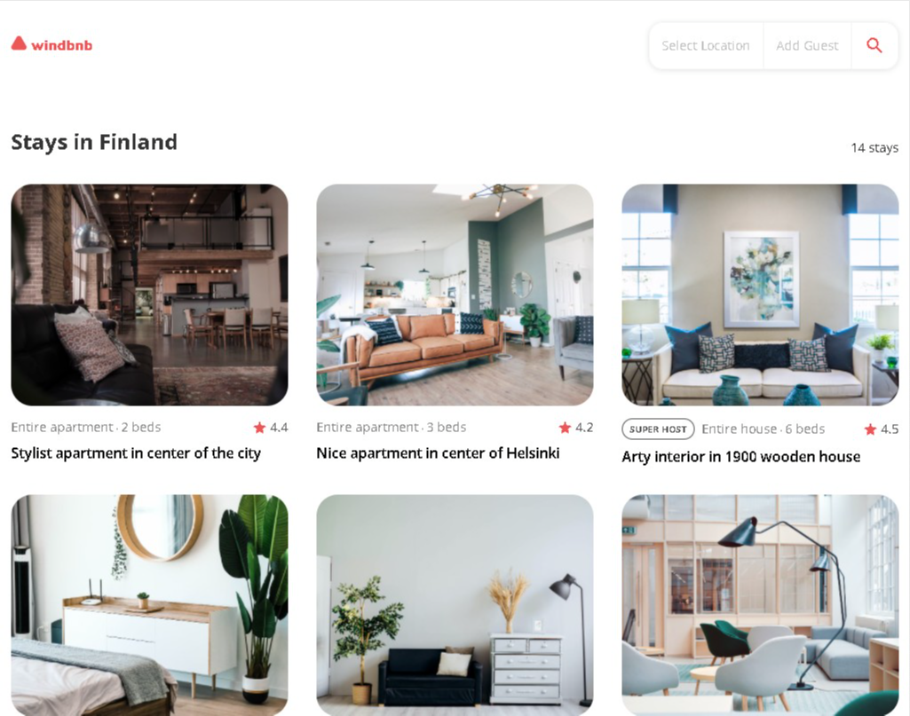

<h1 align="center">React Windbnb Challenge</h1>

<div align="center">
   Solution for this challenge from  <a href="https://www.joeyjenson.com/" target="_blank">Joey Jenson</a>.
</div>

<div align="center">
  <h3>
    <a href="https://jjrock36.github.io/react-windbnb/">
      Demo
    </a>
    <span> | </span>
    <a href="https://github.com/jjrock36/react-windbnb">
      Solution
    </a>
    <span> | </span>
    <a href="https://devchallenges.io/challenges/0J1NxxGhOUYVqihwegfO">
      Challenge
    </a>
  </h3>
</div>

<!-- TABLE OF CONTENTS -->

## Table of Contents

- [Overview](#overview)
- [Built With](#built-with)
- [Features](#features)
- [Contact](#contact)
- [Acknowledgements](#acknowledgements)

<!-- OVERVIEW -->

## Overview



Windbnb is a responsive, mock Airbnb website built using React.js and CSS. The application is a simple design with a search/filter modal that filters by a few locations and number of guests.

Making this project took a bit longer than I wanted it to take, but I learned more about context, reusable components, filtering in React, and working with data in React.

This application/site was created as a submission to a [DevChallenges](https://devchallenges.io/paths/front-end-developer) challenge. The [challenge](https://devchallenges.io/challenges/0J1NxxGhOUYVqihwegfO) was to build an application to complete the given user stories.

### Built With

<!-- This section should list any major frameworks that you built your project using. Here are a few examples.-->

- [React](https://reactjs.org/)

## Features

<!-- List the features of your application or follow the template. Don't share the figma file here :) -->

- Responsive, mobile-first
- Dynamic properties list
- Dynamic number of properties
- Dynamic location list filter
- Filter by location
- Filter by number of guests

## How To Use

To clone and run this application, you'll need [Git](https://git-scm.com) and [Node.js](https://nodejs.org/en/download/) (which comes with [npm](http://npmjs.com)) installed on your computer. From your command line:

```bash
# Clone this repository
$ git clone https://github.com/your-user-name/your-project-name

# Install dependencies
$ npm install

# Run the app
$ npm start
```

## Acknowledgements

<!-- This section should list any articles or add-ons/plugins that helps you to complete the project. This is optional but it will help you in the future. For exmpale -->

- [React](https://reactjs.org/)
- [Node.js](https://nodejs.org/)
- [In-Depth React Tutorial: Build a Hotel Reservation Site](https://www.youtube.com/watch?v=LXJOvkVYQqA)

## Contact

- Website [joeyjenson.com](https://www.joeyjenson.com/)
- GitHub [@jjrock36](https://github.com/jjrock36)
- Twitter [@jjrock36](https://twitter.com/jjrock36)
